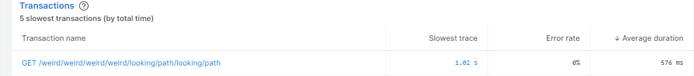

# newrelic-issue

Example to demonstrate issue with APM

Node version 18.16.0

## Create .env file with these values:

`NEW_RELIC_LICENSE_KEY=<api key>`

`NEW_RELIC_APP_NAME=<app name>`

## Run app

`npm i`

`npm run dev`

## Hit end point a few times to send data

`curl http://localhost:3000/weird/looking/path`

## Example

